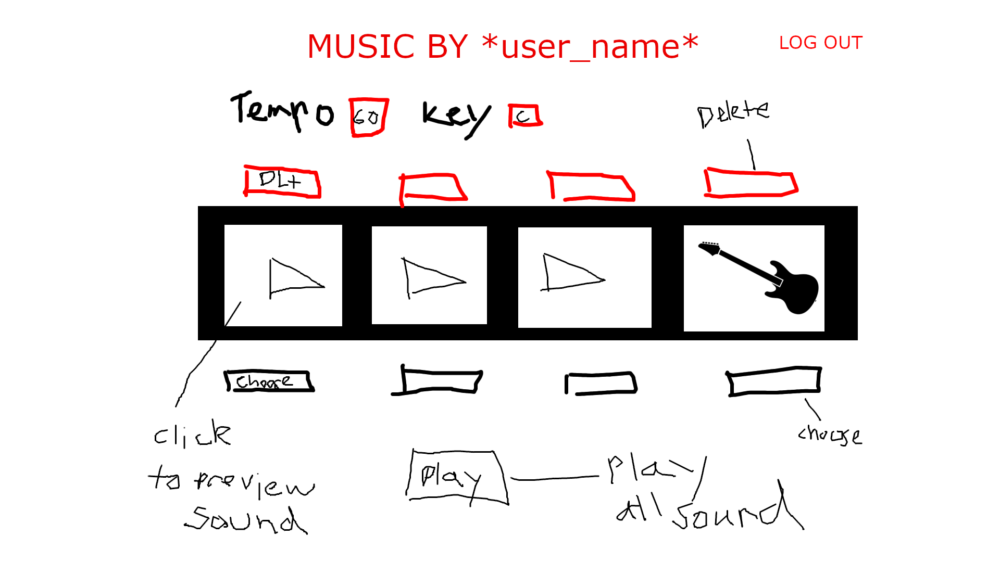

<h1>Music Maker Website</h1>
<h3>Heroku Link:</h3>

https://sheltered-forest-89646.herokuapp.com/

<h2>Wire Frame</h2>

<h2>User Functionality</h2>

1 Users can log in and out, and whatever music they made from their last session will be saved.

2 Users can sign up with username, email and password.

<h2>Music Functionality</h2>

1 A tempo and Key must be selected before selecting instruments.

2 When selected the Query string will filter the search.

3 Users can choose up to 4 instruments, play them individually or play them all together.

4 If users want to delete the sounds and choose something new they can.

<h3>API used</h3>
https://freesound.org/docs/api/

https://sheltered-forest-89646.herokuapp.com/